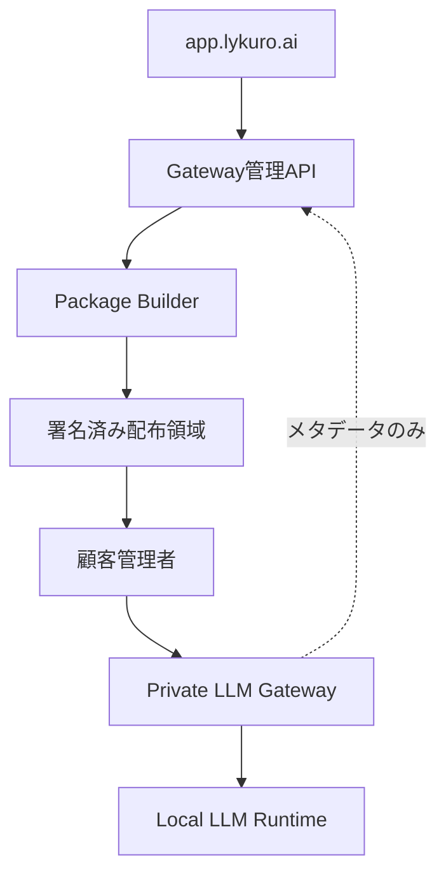

# Private LLM Gateway 導入・配布機能 追加仕様書

| 項目 | 内容 |
|---|---|
| 文書番号 | LYK-PLG-ADD-001 |
| 版 | v1.0 |
| 作成日 | 2026-08-06 |
| 対象 | app.lykuro.ai 企業版、Private LLM Gateway、配布・導入基盤 |
| 関連文書 | LYK-PLG-BD-001「Lykuro Private LLM Gateway 基本設計書」 |
| 実装担当 | Claude Codeおよび開発担当者 |

---

## 0. Claude Codeへの実装指示

本書は既存の `app.lykuro.ai` にPrivate LLM Gatewayの配布・導入・管理機能を追加するための実装仕様である。

Claude Codeは、実装開始前に必ず既存リポジトリを調査し、次を報告すること。

1. フロントエンド、バックエンド、DB、認証、ジョブ、オブジェクトストレージの技術構成
2. 企業・テナント・ユーザー・ロールの既存データモデル
3. 既存のAPI命名、エラー形式、監査ログ、画面ルーティング規約
4. マイグレーション、テスト、CI/CD、環境変数の管理方法
5. 本仕様を既存構成へ適合させる際の変更点

### 0.1 実装上の絶対条件

- 既存の認証、企業判定、課金、監査、デザインシステムを無断で置き換えない。
- 個人ユーザーにはPrivate LLM Gatewayメニューを表示しない。
- 企業ユーザーでも、許可ロール以外には作成・ダウンロード・更新操作を許可しない。
- プロンプト、回答本文、添付ファイルをLykuro制御プレーンへ送信しない。
- 顧客環境へのNode.js、npm、nvmの直接インストールを必須にしない。
- インストーラーからOSパッケージを無断で追加・更新しない。
- `curl URL | sh` を正式な企業向け導入手順にしない。
- 長期秘密鍵、顧客パスワード、Registryパスワードを配布アーカイブへ平文保存しない。
- DB変更はマイグレーション化し、ロールバックまたは後方互換性を確保する。
- 破壊的変更、既存API削除、認証方式変更は別途承認を必要とする。

### 0.2 実装方法の原則

- 本書のパスやクラス名は論理名である。既存リポジトリの規約に合わせて変更してよい。
- 変更理由と対応関係を実装報告書へ残すこと。
- 1つの巨大変更にせず、DB、API、画面、配布、Gateway、テストの単位でコミット可能にする。
- 未確定事項は推測で本番実装せず、feature flagまたは設定値として分離する。

---

## 1. 目的

企業管理者が既存の `app.lykuro.ai` から、顧客環境専用のPrivate LLM Gatewayを作成し、安全な導入パッケージをダウンロードできるようにする。

インストール後のPrivate LLM Gatewayは、顧客ネットワーク内で常時稼働するOpenAI互換Web APIサービスとして動作する。コマンドはインストール、診断、更新、ロールバック等の運用に限定する。

### 1.1 提供価値

- 企業内LLMを既存アプリやAIエージェントから統一APIで利用できる。
- 顧客のプロンプトと回答を顧客環境内に保持できる。
- Lykuroの仮想キー、RBAC、ポリシー、監査、利用量管理と統合できる。
- vLLM、Ollama、TGI等の推論基盤差異をGatewayで吸収できる。
- オンライン、Kubernetes、閉域・オフラインの導入形態に対応できる。

---

## 2. 対象範囲

### 2.1 本仕様の対象

1. app.lykuro.ai企業管理画面
2. Gatewayデプロイメント管理API
3. 顧客別インストールパッケージ生成
4. 期限付きダウンロード
5. 初回登録用ワンタイムトークン
6. Docker Compose版インストーラー
7. Kubernetes/Helm版インストーラー
8. オフライン版配布パッケージ
9. 顧客環境で稼働するGateway Web API
10. Control Agentによる設定取得、署名検証、ヘルス報告
11. バージョン更新、ロールバック、監査ログ

### 2.2 対象外

- 基盤LLMの学習、ファインチューニング
- 顧客RAGデータの整備
- 顧客GPUドライバーの自動インストール
- 顧客OSのパッケージ更新
- Private LLM Gatewayソースコードの顧客向け販売機能
- 無認証の一般公開AI API

---

## 3. 提供形態

| Edition | 提供物 | 主な対象 |
|---|---|---|
| PoC Edition | Docker Compose、インストールCLI、設定テンプレート | 小規模検証 |
| Enterprise Edition | OCIイメージ、Helm Chart、HA設定 | Kubernetes本番環境 |
| Air-Gapped Edition | OCIイメージtar、Helm/Compose、オフラインライセンス | 閉域・オフライン環境 |

### 3.1 ソースコード方針

- 標準契約ではソースコードを配布しない。
- 顧客には署名済みOCIイメージ、設定、SBOM、手順書を提供する。
- OEM、ソースライセンス、ソースエスクローは別契約とし、本機能の対象外とする。

### 3.2 パッケージ種別

#### オンライン版

- インストーラー、設定テンプレート、署名情報を配布する。
- OCIイメージはLykuro Registryまたは顧客Registryから取得する。
- 初回登録時のみワンタイムトークンを使用する。

#### オフライン版

- 必要なOCIイメージを `offline-images.tar` に含める。
- オフライン署名ライセンスを含められる。
- 外部通信なしで起動できる。
- 設定更新は署名済み設定ファイルの手動インポートに対応する。

---

## 4. 全体アーキテクチャ



### 4.1 制御プレーン

Lykuro側に配置する。

- テナント、Gateway、モデル、ポリシー、ライセンス管理
- パッケージ生成と配布
- 設定バージョン管理
- Gatewayヘルス、利用量、監査メタデータ
- ソフトウェア更新通知

### 4.2 データプレーン

顧客環境に配置する。

- OpenAI互換API
- 認証、認可、仮想キー
- Policy Engine
- Model Router
- Inference Adapter
- ローカル監査ログ
- Control Agent

### 4.3 通信原則

- 顧客環境からLykuroへのHTTPS 443 Outboundのみを既定とする。
- Lykuroから顧客ネットワークへのInbound接続を要求しない。
- Strict Local Modeではプロンプト、回答、添付本文を顧客環境外へ送信しない。
- 制御プレーンへ送信可能な項目は許可リスト方式で管理する。

送信可能な既定項目：

- tenant_id
- gateway_id
- model_id
- request_count
- input_tokens
- output_tokens
- latency_ms
- result_code
- policy_decision
- software_version
- health_status

---

## 5. ユーザー・権限

既存RBACへ次の論理権限を追加する。既存ロール名称が異なる場合はマッピングする。

| 権限 | Tenant Owner | AI Administrator | Security Auditor | Billing Viewer | Developer |
|---|---:|---:|---:|---:|---:|
| Gateway一覧参照 | ○ | ○ | ○ | ○ | ○ |
| Gateway作成 | ○ | ○ | × | × | × |
| パッケージ生成 | ○ | ○ | × | × | × |
| パッケージDL | ○ | ○ | × | × | × |
| ポリシー変更 | ○ | ○ | 参照 | × | × |
| キー発行 | ○ | ○ | × | × | × |
| 監査ログ参照 | ○ | ○ | ○ | × | × |
| 利用量参照 | ○ | ○ | ○ | ○ | 自分のみ |
| Gateway失効 | ○ | ○ | × | × | × |

すべてのAPIでサーバー側権限検証を行う。画面非表示だけで権限を実現してはならない。

---

## 6. app.lykuro.ai 画面仕様

既存の企業管理ナビゲーションへ「Private LLM Gateway」を追加する。

論理ルート例：

```text
/enterprise/private-gateways
/enterprise/private-gateways/new
/enterprise/private-gateways/:gatewayId
/enterprise/private-gateways/:gatewayId/install
/enterprise/private-gateways/:gatewayId/audit
```

実際のルートは既存規約へ合わせる。

### 6.1 Gateway一覧画面

表示項目：

| 項目 | 内容 |
|---|---|
| Gateway名 | 顧客が設定した表示名 |
| Gateway ID | システム採番ID |
| Edition | PoC / Enterprise / Air-Gapped |
| 環境 | Docker / Kubernetes / Offline |
| 地域 | 顧客入力値 |
| 状態 | 状態モデルに従う |
| バージョン | 稼働中Gatewayバージョン |
| 最終接続 | 最新heartbeat時刻 |
| モデル数 | 許可モデル数 |
| 操作 | 詳細、インストール、更新、失効 |

フィルター：状態、Edition、環境、地域、バージョン。

### 6.2 新規Gateway作成画面

入力項目：

- Gateway名：必須、1〜80文字
- Environment：development / staging / production
- Edition：PoC / Enterprise / Air-Gapped
- Deployment Type：Docker Compose / Kubernetes / Offline Docker / Offline Kubernetes
- CPU Architecture：amd64 / arm64
- Runtime Adapter：vLLM / Ollama / TGI / Custom OpenAI Compatible
- GPU：NVIDIA / CPU Only / Customer Managed
- Strict Local Mode：既定ON。本番環境ではOFF変更に追加確認を要求
- Region Label：任意
- Allowed Data Classes：public / internal / confidential / restricted
- Gateway API Hostname：任意。例 `ai-gateway.customer.local`

作成時に確認画面を表示し、Strict Local Modeと本文非送信を明示する。

### 6.3 Gateway詳細画面

タブ構成：

1. 概要
2. インストール
3. モデル
4. ポリシー
5. 仮想キー
6. 利用量
7. 監査
8. バージョン

概要表示：接続状態、最終heartbeat、稼働時間、バージョン、設定世代、エラー、ライセンス期限。

### 6.4 インストール画面

表示内容：

- 対象OS、アーキテクチャ、Deployment Type
- パッケージバージョン
- 生成日時、有効期限
- SHA-256
- 電子署名情報
- ダウンロードボタン
- インストールコマンドのコピー
- 再生成ボタン
- ダウンロード履歴

ダウンロード前に次を確認させる。

- パッケージは指定企業専用である。
- 第三者へ再配布しない。
- 初期登録トークンには有効期限と利用回数制限がある。
- 導入は顧客のインフラ管理者が実施する。

### 6.5 バージョン更新画面

- 現在バージョン
- 利用可能バージョン
- リリースノート
- 互換性・必要作業
- 更新パッケージ生成
- ロールバック可能バージョン
- Critical更新の期限

---

## 7. Gateway状態モデル

| 状態 | 意味 |
|---|---|
| draft | 作成途中 |
| package_pending | パッケージ生成待ち |
| package_building | 生成中 |
| package_ready | ダウンロード可能 |
| downloaded | 1回以上ダウンロード済み |
| registering | 初回登録中 |
| online | 正常接続 |
| degraded | 一部機能またはモデルに障害 |
| offline | heartbeat期限超過 |
| suspended | 管理者が一時停止 |
| revoked | ライセンスまたはGatewayを失効 |
| build_failed | パッケージ生成失敗 |

状態遷移はサーバー側で検証し、不正な直接更新を禁止する。

---

## 8. 制御プレーンAPI

APIパスは論理例であり、既存のバージョニング規約へ合わせる。

### 8.1 管理API

| Method | Path | 用途 |
|---|---|---|
| GET | `/api/enterprise/private-gateways` | 一覧 |
| POST | `/api/enterprise/private-gateways` | 新規作成 |
| GET | `/api/enterprise/private-gateways/{id}` | 詳細 |
| PATCH | `/api/enterprise/private-gateways/{id}` | 設定更新 |
| POST | `/api/enterprise/private-gateways/{id}/packages` | パッケージ生成 |
| GET | `/api/enterprise/private-gateways/{id}/packages` | パッケージ履歴 |
| POST | `/api/enterprise/private-gateways/{id}/packages/{packageId}/download` | 期限付きDL発行 |
| POST | `/api/enterprise/private-gateways/{id}/install-token` | ワンタイムトークン発行 |
| POST | `/api/enterprise/private-gateways/{id}/revoke` | Gateway失効 |
| GET | `/api/enterprise/private-gateways/{id}/audit` | 監査ログ |
| GET | `/api/enterprise/private-gateways/{id}/versions` | バージョン一覧 |

### 8.2 Gateway Agent API

| Method | Path | 用途 |
|---|---|---|
| POST | `/api/gateway/register` | 初回登録 |
| POST | `/api/gateway/heartbeat` | ヘルス報告 |
| GET | `/api/gateway/config` | 最新設定取得 |
| POST | `/api/gateway/config/ack` | 適用結果報告 |
| POST | `/api/gateway/usage` | 利用量メタデータ送信 |
| POST | `/api/gateway/events` | 許可済み監査イベント送信 |
| GET | `/api/gateway/releases` | 利用可能リリース確認 |

### 8.3 API共通要件

- tenant_idはリクエスト本文ではなく認証コンテキストから確定する。
- Gateway IDだけで他テナントの情報へアクセスできないこと。
- 作成・生成系APIはIdempotency-Keyに対応する。
- エラーは既存APIの共通形式へ統一する。
- すべての管理操作にactor、tenant、request_id、結果を記録する。
- Gateway Agent認証は端末証明書または署名済み短期トークンへ移行可能な構造にする。

### 8.4 ダウンロードAPI要件

- ファイル本体を公開URLに置かない。
- 認可後に短時間有効なダウンロードURLを発行する。
- 有効期限は既定15分、最大60分とする。
- package_id、user_id、IP、user_agent、結果を監査する。
- 同じパッケージのダウンロード回数を保持する。
- 失効・期限切れパッケージはダウンロード不可とする。

---

## 9. データモデル

既存ORMと命名規約に合わせる。以下は論理モデルである。

### 9.1 gateway_deployments

```text
id                    UUID/ULID PK
tenant_id             FK, NOT NULL
name                  VARCHAR(80)
environment           ENUM
edition               ENUM
deployment_type       ENUM
cpu_arch              ENUM(amd64, arm64)
runtime_adapter       ENUM
gpu_mode              ENUM
strict_local_mode     BOOLEAN DEFAULT true
region_label          VARCHAR(100) NULL
hostname              VARCHAR(255) NULL
status                ENUM
installed_version     VARCHAR(50) NULL
desired_version       VARCHAR(50) NULL
config_version        BIGINT DEFAULT 0
last_seen_at          TIMESTAMP NULL
license_expires_at    TIMESTAMP NULL
created_by            FK user
created_at            TIMESTAMP
updated_at            TIMESTAMP
revoked_at            TIMESTAMP NULL
```

インデックス：tenant_id、status、last_seen_at、tenant_id + name。

### 9.2 gateway_packages

```text
id                    UUID/ULID PK
gateway_id            FK
package_version       VARCHAR(50)
package_type          ENUM(online, offline, helm, compose)
build_status          ENUM
storage_key           VARCHAR(500)
sha256                CHAR(64)
signature_ref         VARCHAR(500)
size_bytes            BIGINT
expires_at            TIMESTAMP
created_by            FK user
created_at            TIMESTAMP
build_error_code      VARCHAR(100) NULL
build_error_detail    TEXT NULL (秘密情報を除去)
```

### 9.3 gateway_install_tokens

```text
id                    UUID/ULID PK
gateway_id            FK
token_hash            VARCHAR(255)
expires_at            TIMESTAMP
max_uses              INTEGER DEFAULT 1
used_count            INTEGER DEFAULT 0
used_at               TIMESTAMP NULL
created_by            FK user
created_at            TIMESTAMP
revoked_at            TIMESTAMP NULL
```

トークン原文は作成時のみ返し、DBにはハッシュだけを保存する。

### 9.4 gateway_config_versions

```text
id                    UUID/ULID PK
gateway_id            FK
version               BIGINT
config_json           JSON/JSONB
config_hash           CHAR(64)
signature             TEXT
effective_at          TIMESTAMP
created_by            FK user
created_at            TIMESTAMP
```

config_jsonへ秘密鍵、Registryパスワード、顧客本文を保存しない。

### 9.5 gateway_heartbeats

高頻度になるため、既存のメトリクス基盤があればDBテーブルよりそちらを優先する。

```text
gateway_id
received_at
software_version
config_version
status
uptime_seconds
adapter_health
queue_depth
error_summary
```

### 9.6 gateway_download_events

```text
id
tenant_id
gateway_id
package_id
actor_user_id
ip_address
user_agent
result
created_at
```

---

## 10. パッケージ生成

パッケージ生成はWebリクエスト内で同期実行せず、既存ジョブ基盤または専用Package Builder Workerで行う。

### 10.1 生成入力

- tenant_id
- gateway_id
- edition
- deployment_type
- cpu_arch
- runtime_adapter
- target_version
- online/offline
- config_version

### 10.2 パッケージ内容

```text
lykuro-private-gateway-{gateway_id}-{version}/
├── install.sh
├── lykuro-gateway
├── docker-compose.yml
├── helm/
│   └── lykuro-private-gateway/
├── config/
│   ├── gateway.example.yaml
│   ├── policy.example.yaml
│   └── runtime.example.yaml
├── images/
│   └── offline-images.tar        # オフライン版のみ
├── licenses/
│   └── offline-license.jwt       # 必要な場合のみ
├── checksums.txt
├── manifest.json
├── signature.sig
├── sbom/
└── docs/
    ├── INSTALL.md
    ├── UPGRADE.md
    └── SECURITY.md
```

### 10.3 manifest.json

```json
{
  "schema_version": "1",
  "product": "lykuro-private-llm-gateway",
  "gateway_id": "gw_xxx",
  "tenant_id": "tn_xxx",
  "version": "1.0.0",
  "edition": "enterprise",
  "deployment_type": "kubernetes",
  "cpu_arch": "amd64",
  "strict_local_mode": true,
  "created_at": "2026-08-06T00:00:00Z",
  "expires_at": "2026-08-07T00:00:00Z",
  "files": []
}
```

manifestには秘密情報を含めない。

### 10.4 署名・完全性

- アーカイブ生成前に各ファイルのSHA-256を作成する。
- manifestとchecksumsをLykuro署名鍵で署名する。
- OCIイメージは可能な限りcosign等で署名する。
- 署名鍵はKMS/HSMまたは既存Secret Managerで管理する。
- Package Builderへ長期署名秘密鍵を環境変数で直接渡さない。
- SBOMをCycloneDXまたはSPDX形式で同梱する。

### 10.5 保持期間

- オンラインパッケージ：既定24時間
- オフラインパッケージ：既定7日
- 期限切れ後は配布領域から削除可能にする。
- 監査イベントとハッシュは契約上の保持期間に従って残す。

---

## 11. インストーラー・CLI仕様

### 11.1 基本方針

- 本体はWeb APIサービスとして常時稼働する。
- CLIは導入、保守、診断専用とする。
- 顧客環境でNode.js/npm/nvmを要求しない。
- Gateway本体は署名済みコンテナまたは単一バイナリとして提供する。
- `install.sh` はPOSIX互換を基本とし、Bash固有機能を使用する場合は起動時に検査する。
- sudoが必要な処理は実行前に一覧表示し、明示同意なしに実行しない。
- 前提不足時はOS変更を行わず、必要項目と管理者向け手順を表示して終了する。

### 11.2 CLIコマンド

```text
lykuro-gateway precheck
lykuro-gateway install
lykuro-gateway register
lykuro-gateway start
lykuro-gateway stop
lykuro-gateway restart
lykuro-gateway status
lykuro-gateway health
lykuro-gateway logs
lykuro-gateway diagnose
lykuro-gateway config validate
lykuro-gateway config import
lykuro-gateway upgrade
lykuro-gateway rollback
lykuro-gateway uninstall
```

### 11.3 precheck

確認項目：

- OS、カーネル、CPU architecture
- 利用可能メモリ、ディスク
- Docker/PodmanまたはKubernetes
- compose、kubectl、helm
- NVIDIA Driver、NVIDIA Container Toolkit
- DNS、指定ポート、時刻同期
- Lykuro制御プレーンへのHTTPS接続
- Local LLM Runtimeへの接続
- 証明書と秘密情報保存先

出力は人間向け表示とJSON形式の両方に対応する。

```bash
./install.sh precheck --output json
```

### 11.4 install

例：

```bash
./install.sh install \
  --profile docker \
  --config ./config/gateway.yaml \
  --install-token-file ./install-token.txt
```

Kubernetes：

```bash
./install.sh install \
  --profile kubernetes \
  --namespace lykuro-gateway \
  --values ./values.customer.yaml
```

トークンをコマンドライン引数へ直接書く方式はshell historyに残るため、ファイル、標準入力、Secret連携を優先する。

### 11.5 ファイル配置

root権限利用時の既定：

```text
/etc/lykuro/gateway/       設定
/var/lib/lykuro/gateway/   状態、Last Known Good
/var/log/lykuro/gateway/   ローカルログ
/opt/lykuro/gateway/       CLI、補助ファイル
```

rootless利用時：

```text
$XDG_CONFIG_HOME/lykuro/gateway/
$XDG_DATA_HOME/lykuro/gateway/
$XDG_STATE_HOME/lykuro/gateway/
```

ホームディレクトリを決め打ちせず、XDG変数未設定時のみ安全な既定値を使用する。

### 11.6 終了コード

| Code | 意味 |
|---:|---|
| 0 | 成功 |
| 2 | 引数・設定不正 |
| 10 | 前提ソフトウェア不足 |
| 11 | 権限不足 |
| 12 | ディスク・メモリ不足 |
| 20 | 署名・チェックサム不正 |
| 21 | パッケージ期限切れ |
| 30 | 初回登録失敗 |
| 31 | ライセンス不正 |
| 40 | コンテナ起動失敗 |
| 41 | ヘルスチェック失敗 |
| 50 | 更新失敗。ロールバック実行対象 |

### 11.7 uninstall

- 既定では設定、監査ログ、モデルを削除しない。
- `--purge` 指定時のみデータ削除を許可する。
- purge対象と保持対象を実行前に表示し、確認を要求する。
- 顧客のLLMモデル、RAGデータ、他サービスのコンテナを削除しない。

---

## 12. Private LLM Gateway Web API

### 12.1 サービス特性

- 常時稼働するHTTP/HTTPS Web APIサービス
- ステートレスなGateway処理を基本とする
- ローカル監査・キュー等の必要状態は外部ストレージへ分離可能にする
- OpenAI互換レスポンス形式を維持する
- ストリーミングはSSEに対応する

### 12.2 API

| Method | Path | MVP |
|---|---|---:|
| GET | `/v1/models` | ○ |
| POST | `/v1/chat/completions` | ○ |
| POST | `/v1/embeddings` | ○ |
| POST | `/v1/responses` | Phase 2 |
| POST | `/v1/rerank` | Phase 2 |
| GET | `/healthz` | ○ |
| GET | `/readyz` | ○ |
| GET | `/version` | ○ |

### 12.3 リクエストヘッダー

| Header | 必須 | 内容 |
|---|---:|---|
| Authorization | ○ | Bearer仮想キーまたはOIDC/JWT |
| Content-Type | ○ | application/json |
| X-Lykuro-Project | 推奨 | プロジェクト識別 |
| X-Request-ID | 任意 | 未指定時はGateway生成 |
| X-Data-Class | 条件 | public/internal/confidential/restricted |
| X-Routing-Mode | 条件 | local-only/hybrid。ポリシーを優先 |

### 12.4 リクエスト処理順序

1. Request ID確定
2. 認証
3. tenant/project/actor解決
4. レート・予算制限
5. 入力サイズ・形式検証
6. 機密区分・PII・ポリシー判定
7. 論理モデルを物理モデルへ解決
8. Runtime Adapter形式へ変換
9. 推論実行
10. ストリーミング出力検査
11. ローカル監査記録
12. 本文を除く利用量メタデータを非同期送信

### 12.5 エラー形式

OpenAI互換を維持しつつ、Lykuro固有コードを追加する。

```json
{
  "error": {
    "message": "The requested model is not allowed by policy.",
    "type": "policy_error",
    "code": "policy_denied",
    "request_id": "req_xxx"
  }
}
```

| HTTP | code | 条件 |
|---:|---|---|
| 400 | invalid_request | 形式不正 |
| 401 | authentication_failed | キー/JWT不正 |
| 403 | policy_denied | モデル、用途、機密区分が不許可 |
| 409 | config_not_ready | 有効設定がない |
| 429 | rate_limit_exceeded | RPS、同時実行、トークン超過 |
| 503 | model_unavailable | モデル未ロード、GPU障害 |
| 504 | inference_timeout | 推論時間超過 |

---

## 13. 設定配信・Control Agent

### 13.1 初回登録

1. app.lykuro.aiでワンタイムトークンを発行
2. 顧客管理者がインストーラーへ安全に入力
3. AgentがGateway ID、パッケージ情報、公開鍵等を送信
4. 制御プレーンがtenant、gateway、token、packageを検証
5. 端末認証情報と初期署名設定を発行
6. ワンタイムトークンを使用済みにする

失敗時もトークン原文をログへ記録しない。

### 13.2 設定取得

- Agentは一定間隔で最新config_versionを確認する。
- 設定パッケージの署名とhashを検証する。
- 検証後、staging領域で構文・参照・モデル到達性を確認する。
- 適用成功後にactiveへ切り替える。
- 直前2世代以上をLast Known Goodとして保持する。
- 適用失敗時は現在設定を維持し、エラーコードを報告する。

### 13.3 制御プレーン停止時

- 既存の有効設定で推論を継続する。
- 契約で定めたgrace period内はライセンスを有効とする。
- 本文・監査ログを制御プレーン復旧待ちキューへ入れない。
- 利用量メタデータのみ上限付きローカルキューに保存できる。
- キュー上限超過時の動作は契約設定により継続または制限運転とする。

---

## 14. セキュリティ

### 14.1 認証・秘密情報

- 仮想キーは保存時にハッシュ化する。
- 初回登録トークンは1回のみ表示し、DBにはハッシュ保存する。
- Registry認証は短期credentialまたは顧客Registryへの事前ミラーを推奨する。
- TLS秘密鍵は顧客Secret Manager、Vault、Kubernetes Secret等で管理する。
- 秘密情報をDocker image、SBOM、ログ、診断ファイルに含めない。

### 14.2 Strict Local Mode

既定で次を顧客環境内に保持する。

- プロンプト本文
- 回答本文
- system/developer message
- 添付ファイル
- RAG検索結果
- tool入出力本文

本文ログは既定OFFとする。有効化する場合は顧客管理ストレージ、暗号化、保存期間、閲覧権限を必須設定とする。

### 14.3 Fail Closed

次が不明または検証不能な場合は処理を拒否する。

- tenant/project
- 認証結果
- データ機密区分
- モデル許可
- 設定署名
- 高機密経路

可用性を理由に未承認クラウドLLMへ自動送信しない。

### 14.4 監査イベント

- Gateway作成・更新・失効
- パッケージ生成・ダウンロード
- 初回登録成功・失敗
- 設定取得・署名検証・適用
- キー発行・失効
- モデル登録・許可・停止
- ポリシー判定・拒否
- 推論開始・完了・中断
- バージョン更新・ロールバック

制御プレーンへ送る監査項目から本文を除外する。

---

## 15. ライセンス

ライセンスは少なくとも次へ紐付ける。

- tenant_id
- gateway_id
- edition
- allowed_versionsまたは更新権
- allowed_modelsまたはモデル数
- expires_at
- offline_grace_period
- signature

オンラインライセンス確認失敗時に即時停止させず、Last Known Goodライセンスとgrace periodを適用する。期限超過後の動作は契約別にFail Closedまたは限定運転を選択できるようにする。

---

## 16. 更新・ロールバック

### 16.1 更新方式

- Docker Compose：新イメージpull、互換性検査、再起動、health確認
- Kubernetes：Rolling UpdateまたはBlue/Green
- Offline：更新アーカイブの署名検証後にimport

### 16.2 更新前チェック

- 現在バージョン
- 更新元・更新先互換性
- 設定schema
- DB/ローカル状態migration
- ディスク容量
- 署名、SBOM、脆弱性情報
- ロールバック対象イメージの存在

### 16.3 自動ロールバック

更新後に次のいずれかを満たした場合は自動ロールバック対象とする。

- `/healthz` 失敗
- `/readyz` が規定時間内に成功しない
- 設定読み込み失敗
- Model Adapter初期化失敗
- 重大なmigration失敗

---

## 17. 可観測性

### 17.1 メトリクス

- request_total
- request_duration_seconds
- first_token_latency_seconds
- input_tokens_total
- output_tokens_total
- active_streams
- policy_denied_total
- rate_limited_total
- model_errors_total
- runtime_queue_depth
- config_version
- heartbeat_success

Prometheus形式のローカルendpointを設定で有効化できるようにする。外部公開しない。

### 17.2 ログ

- JSON構造化ログ
- request_id、gateway_id、model_id、result_codeを含める
- APIキー、JWT、Authorization、本文を出力しない
- 診断bundle生成時もsecret redactionを適用する

### 17.3 ヘルス

- `/healthz`：プロセス生存確認。認証不要、情報最小化
- `/readyz`：設定、Runtime、必須依存関係の準備状態
- 詳細ヘルスは管理認証を必須にする

---

## 18. 環境変数・設定

環境変数名は既存規約へ適合させる。

```text
LYKURO_CONTROL_PLANE_URL
LYKURO_GATEWAY_ID
LYKURO_TENANT_ID
LYKURO_CONFIG_PATH
LYKURO_DATA_DIR
LYKURO_LOG_LEVEL
LYKURO_STRICT_LOCAL_MODE
LYKURO_RUNTIME_TYPE
LYKURO_RUNTIME_ENDPOINT
LYKURO_TLS_CERT_PATH
LYKURO_TLS_KEY_PATH
LYKURO_METRICS_ENABLED
LYKURO_HEARTBEAT_INTERVAL_SECONDS
LYKURO_CONFIG_POLL_INTERVAL_SECONDS
```

install token、秘密鍵、Registryパスワードを通常の環境変数へ平文設定することは避け、secret fileまたはsecret manager参照を優先する。

---

## 19. 推奨リポジトリ構成

既存がmonorepoの場合の論理例：

```text
apps/
├── web/                         # app.lykuro.ai
├── api/                         # 制御プレーンAPI
├── package-builder-worker/      # 配布パッケージ生成
└── private-gateway/             # 顧客環境Web API
packages/
├── gateway-contracts/           # API/schema共有
├── gateway-cli/                 # 導入・保守CLI
├── gateway-policy/              # ポリシー共通定義
└── gateway-adapters/            # vLLM/Ollama/TGI
deploy/
├── compose/
├── helm/
├── installer/
└── offline/
docs/
└── private-gateway/
```

別リポジトリに分割する場合も、API schemaとリリースバージョンの互換性をCIで検証する。

---

## 20. 実装フェーズ

### Phase 0：既存構成調査

成果物：

- 技術スタック調査結果
- 既存モデルとのマッピング
- 実装対象ファイル一覧
- リスクと未決事項
- テスト実行方法

この報告を出す前に大規模変更を開始しない。

### Phase 1：データモデル・管理API

- migration
- repository/service
- RBAC
- CRUD API
- 状態遷移
- 監査
- unit/integration test

### Phase 2：企業管理画面

- 一覧
- 作成wizard
- 詳細
- インストール
- ダウンロード
- バージョン
- 権限別表示
- API error handling

### Phase 3：Package Builder

- 非同期ジョブ
- template rendering
- checksum
- signature
- storage upload
- retention cleanup
- build failure recovery

### Phase 4：Gateway Web API MVP

- `/v1/models`
- `/v1/chat/completions`
- `/v1/embeddings`
- SSE streaming
- auth/RBAC
- policy
- Runtime Adapter
- health/ready/version
- audit/metrics

### Phase 5：インストーラー・CLI

- precheck
- Docker Compose install
- Kubernetes/Helm install
- register
- status/logs/diagnose
- upgrade/rollback
- uninstall

### Phase 6：オフライン対応

- OCI export/import
- offline license
- signed config import
- no-network test

### Phase 7：E2E・セキュリティ・運用

- end-to-end test
- tenant isolation test
- package tampering test
- secret scanning
- SBOM/vulnerability scan
- upgrade/rollback rehearsal
- operator documentation

---

## 21. テスト仕様

### 21.1 画面・API

- 個人ユーザーにメニューが表示されない。
- 権限なし企業ユーザーがAPIを直接呼んでも403になる。
- Tenant AがTenant BのGateway IDを指定しても参照できない。
- 同一Idempotency-KeyでGatewayが重複作成されない。
- パッケージ生成状態が画面へ反映される。
- 期限切れURLでダウンロードできない。
- ダウンロード操作が監査される。

### 21.2 パッケージ

- amd64/arm64、Compose/Helmの組合せを生成できる。
- manifest内容とDB情報が一致する。
- 1バイト改ざんでチェックサム検証が失敗する。
- 不正署名パッケージをインストールできない。
- アーカイブに長期secretが含まれない。
- SBOMが存在する。

### 21.3 インストール

- Node.jsなしで導入できる。
- sudoなしの場合はrootless可否を判定し、不可能なら明確な手順を返す。
- 前提不足時にOSを変更しない。
- 再実行しても二重登録・設定破損しない。
- トークンがshell historyとログへ出ない。
- ワンタイムトークンを2回利用できない。

### 21.4 Gateway API

- OpenAI SDKからchat、streaming、models、embeddingsを利用できる。
- 無効キー、期限切れJWT、未許可モデルを拒否する。
- confidential/restrictedが外部経路へ送信されない。
- Strict Local Mode時に本文が制御プレーン通信へ含まれない。
- 本文が既定ログに残らない。
- Runtime停止時に503を返す。
- タイムアウト時に504とrequest_idを返す。

### 21.5 障害・更新

- 制御プレーン停止中もLast Known Good設定で動作する。
- 不正設定を適用せず、直前設定を保持する。
- 更新失敗時に旧バージョンへ戻る。
- オフライン環境で外部通信なしに起動できる。

---

## 22. 受入基準

| ID | 受入項目 | 合格条件 |
|---|---|---|
| AT-01 | 企業限定 | 個人ユーザーから画面・APIとも利用不可 |
| AT-02 | テナント分離 | 他企業のGateway、package、auditへアクセス不可 |
| AT-03 | パッケージ生成 | Compose/Helmの署名済みパッケージを生成可能 |
| AT-04 | 安全なDL | 認可、期限、監査付きでダウンロード可能 |
| AT-05 | 導入 | Node/npmなしで指定環境へ導入可能 |
| AT-06 | Web API | OpenAI互換Chat/Streaming/Models/Embeddingsが利用可能 |
| AT-07 | 本文非送信 | Strict Local Modeで本文が顧客環境外へ送信されない |
| AT-08 | 設定配信 | 署名検証、世代管理、Last Known Goodが動作 |
| AT-09 | 障害復旧 | Runtime障害、制御断、更新失敗から手順どおり復旧 |
| AT-10 | 監査 | 作成、DL、登録、設定、推論、更新を追跡可能 |
| AT-11 | オフライン | Air-Gapped版が外部通信なしで起動可能 |
| AT-12 | セキュリティ | secret scan、改ざん検査、RBAC試験に合格 |

---

## 23. Definition of Done

Claude Codeは、次を満たした状態を完了とする。

- 既存規約に沿った実装になっている。
- migration、API、画面、worker、Gateway、CLIがレビュー可能な単位に分かれている。
- unit、integration、E2Eテストが追加され、実行結果を報告している。
- lint、typecheck、build、既存回帰テストが成功している。
- 新しい環境変数とsecret設定が文書化されている。
- API仕様と画面操作手順が更新されている。
- パッケージにchecksum、signature、SBOMが含まれる。
- Strict Local Modeの通信試験結果が存在する。
- 更新・ロールバック試験結果が存在する。
- 未実装、暫定対応、既知問題が明記されている。

---

## 24. Claude Codeの最終報告形式

```markdown
## 実装概要

## 既存構成への適合内容

## 変更ファイル

## DBマイグレーション

## API追加・変更

## 画面追加・変更

## パッケージ・インストーラー

## セキュリティ対策

## 実行したテストと結果

## 導入・更新手順

## 未決事項・既知問題
```

Claude Codeは、テスト未実行の場合に「成功」と記載してはならない。実環境、GPU、Kubernetes、KMS等がないため検証できない項目は、未検証理由と顧客環境での検証手順を記載すること。

